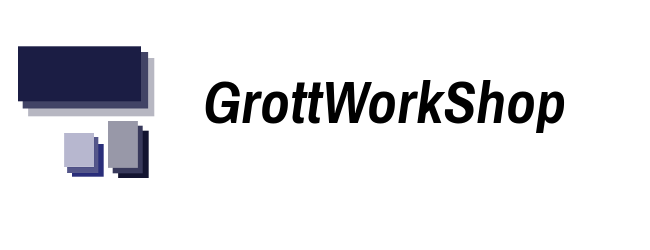

# GWSWayOfAndroid
An in-depth book series on Android Application Development from an Unofficial Android Google Developer Expert.

Code samepls for the most part is organized as android.app, android.security,etc to mathc the android sdk layotu so that I can matchup what needs changing via the android sdk version diff reports. Samepls that do match packagenames are by abbreivated chapter titles.

# Credits

Created by [Fred Grott](http://shareme.github.com).

# License

[Apache 2.0 License](LICENSE)

