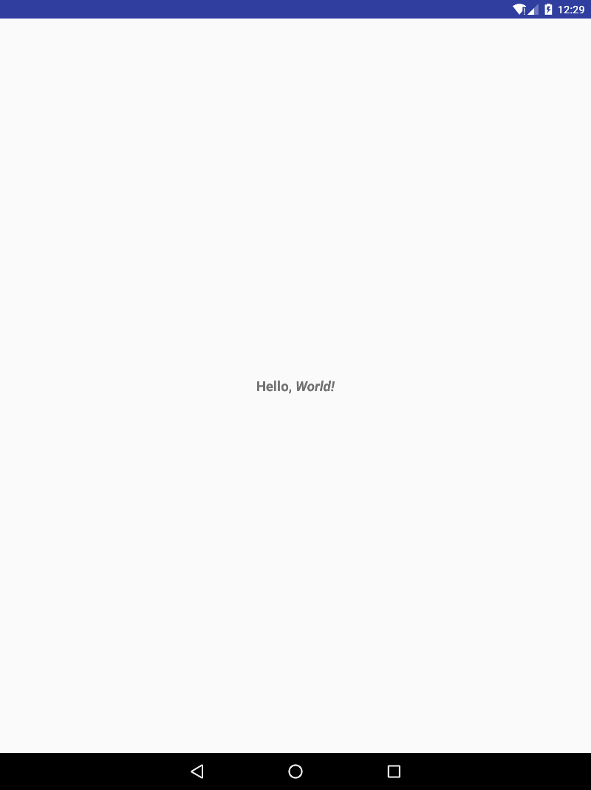

# Hello Droids

Simple Hello Droids app that displays a TextView with a string of text.
Part of the BeginningWayOfAndroid book.

# Developed By

Created by [Fred Grott](http://shareme.github.com).

# Credits

Original concept and code created by Google as part of API demos.

# License

Apache 2.0 License